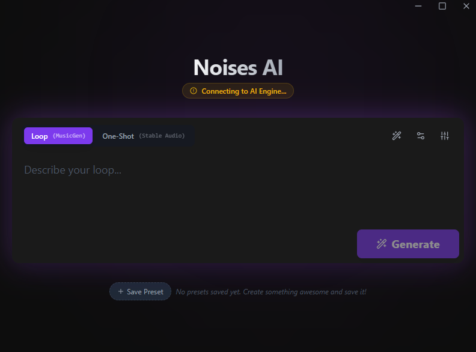
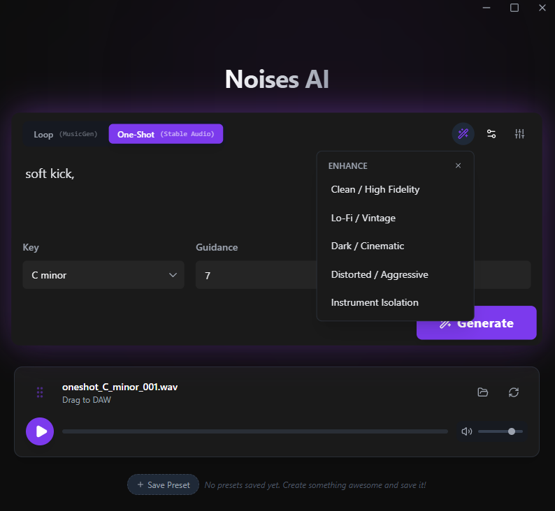

# Noises 🎵

A local AI music generator that lives on your desktop. No subscriptions, no cloud wait times, just noise.

<p float="left">
   
    
</p>

## What is this?

**Noises** is a desktop app built to make generating AI music, samples, and loops effortless. It uses **Tauri** for a lightweight native UI and **Python** to run AI models entirely on your own hardware.

It currently supports two generation modes:

*   **Loops** — Powered by **Stable Audio Open** (Stability AI). Best for short loops, textures, and samples. Supports negative prompts, BPM, and key selection.
*   **Full Songs** — Powered by **ACE-Step**. Generates complete songs with vocals, lyrics, and structure tags. Supports up to 4 minutes of audio.

## Features

- 🎹 **Loops & Samples:** Create short loops at any BPM and Key using Stable Audio Open.
- 🎤 **Full Songs with Vocals:** Generate complete songs with lyrics, genre tags, and structure using ACE-Step.
- 🏠 **100% Local:** Everything runs on your own GPU. Your prompts and music stay private.
- 🎛️ **Full Control:** Tweak inference steps, guidance scale, scheduler type, CFG mode, seed, and more.
- ✨ **Prompt Enhancement:** One-click modifiers for clean/hi-fi, lo-fi, cinematic, aggressive, and other styles.
- 💾 **Presets:** Save and recall your favorite prompt configurations.
- 🎯 **Drag & Drop:** Drag generated audio directly into your DAW.
- 📂 **Organized Output:** All generated files are saved to `~/Music/Noises/` (loops and songs in separate folders).

## How to Run it (The Easy Way)

1. Go to the [Releases](https://github.com/yourusername/noises/releases) page.
2. Download the installer (`Noises_Setup.exe`).
3. Run it, install it, make noise.

> **Requirements:** An NVIDIA GPU (RTX 3060 8GB or better recommended). No manual CUDA installation needed — Noises handles everything automatically.

> **First-run setup:** On first launch, the installer will download and cache PyTorch with CUDA support (~2.5 GB) to `C:\ProgramData\Noises\torch_runtime\`. This is a one-time step. AI models (~3 GB for Stable Audio, ~3.5 GB for ACE-Step) are also downloaded on first use and cached in `~/.cache/huggingface/`. Everything runs offline after that.

> **Troubleshooting:** If setup fails, check `%LOCALAPPDATA%\Noises\setup.log` for details. If something breaks, please open an issue!

## Task Manager & Processes

When running **Noises**, you will see a few different processes in your Task Manager. This is normal!

*   **Noises.exe:** The main application window and lightweight controller.
*   **backend.exe:** The heavy lifter. This is the Python engine running the AI models. It runs as a separate process to keep the UI smooth.
*   **WebView2 / msedgewebview2.exe:** These processes handle the rendering of the user interface (similar to Chrome/Edge tabs).

## Tech Stack

| Layer | Technologies |
|---|---|
| **Frontend** | React, Tailwind CSS, Framer Motion, Lucide Icons |
| **Backend** | Python (FastAPI, Uvicorn), PyTorch, HuggingFace Diffusers, ACE-Step |
| **Desktop** | Rust (Tauri v2), Sidecar process management |
| **Audio** | soundfile, torchaudio, numpy |

## Building from Source

If you want to hack on it yourself:

### Prerequisites

*   **Node.js** 18+
*   **Python** 3.12 (MS Store or python.org — must be Python 3.12 specifically, as the packaged backend is built against it)
*   **Rust** (installed via [rustup](https://rustup.rs))
*   **System Requirements:**
    *   **GPU:** NVIDIA GeForce RTX 3060 (8GB VRAM) or better recommended.
    *   **Minimum:** NVIDIA GPU with 6GB VRAM (Stable Audio). ACE-Step uses CPU offloading to fit within ~8GB peak VRAM.
    *   **Disk Space:** ~11 GB free — ~2.5 GB for PyTorch (`%ProgramData%\Noises\torch_runtime`) + ~8 GB for models (`~/.cache/huggingface`).

### Setup

```bash
# 1. Clone the repo
git clone https://github.com/yourusername/noises.git
cd noises

# 2. Create a Python virtual environment
python -m venv .venv
# Windows:
.venv\Scripts\activate
# Linux/macOS:
# source .venv/bin/activate

# 3. Install Python dependencies
pip install -r backend/requirements.txt

# 4. Install frontend dependencies
cd frontend
npm install
cd ..

# 5. Run in dev mode (from root folder)
npm run tauri dev
```

### Output Location

Generated audio is saved to:

```
~/Music/Noises/
├── samples/
│   ├── loops/       # Stable Audio output (loop_120bpm_C_minor_001.wav, ...)
│   └── oneshots/    # ACE-Step output (song_001.wav, ...)
```

## How It Works

1. **Tauri** starts the native window and spawns the **Python backend** as a sidecar process.
2. The frontend sends generation requests to the backend over HTTP (`127.0.0.1:8000`).
3. The backend loads the requested model on demand and unloads it after generation to free VRAM.
4. Generated audio is post-processed (normalization, fades) and saved as WAV files.
5. The frontend reads the file via Tauri's FS plugin and plays it in the browser audio element.

## Credits

Big thanks to the open source community for making this possible:

*   [ACE-Step](https://github.com/ace-step/ACE-Step) for full song generation with vocals
*   [Stability AI](https://stability.ai/stable-audio) for Stable Audio Open
*   [Tauri](https://tauri.app) for the desktop framework
*   [HuggingFace](https://huggingface.co) for model hosting and Diffusers

## License

MIT License. Do whatever you want with the code, just credit me!

The generated audio is subject to the licenses of the respective models. Check the [ACE-Step](https://github.com/ace-step/ACE-Step) and [Stable Audio Open](https://huggingface.co/stabilityai/stable-audio-open-1.0) repos for commercial use details.

